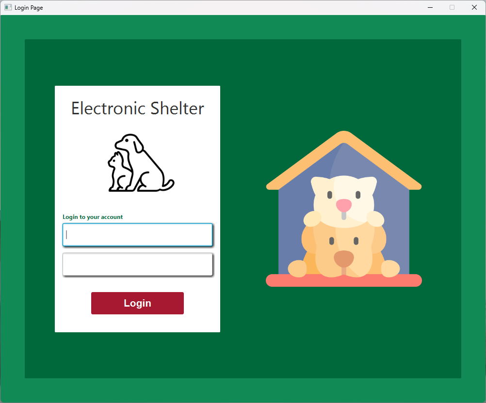
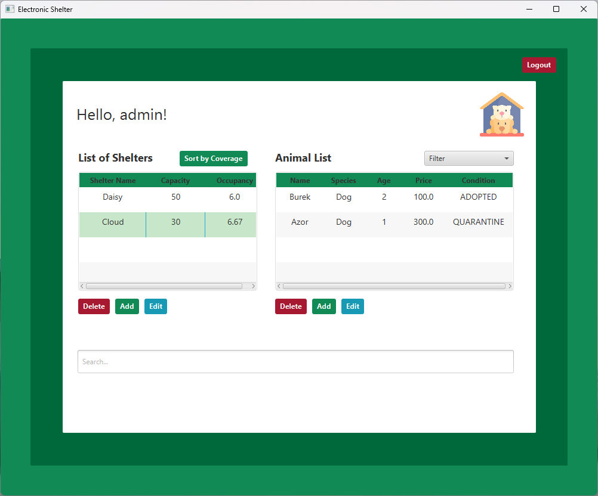
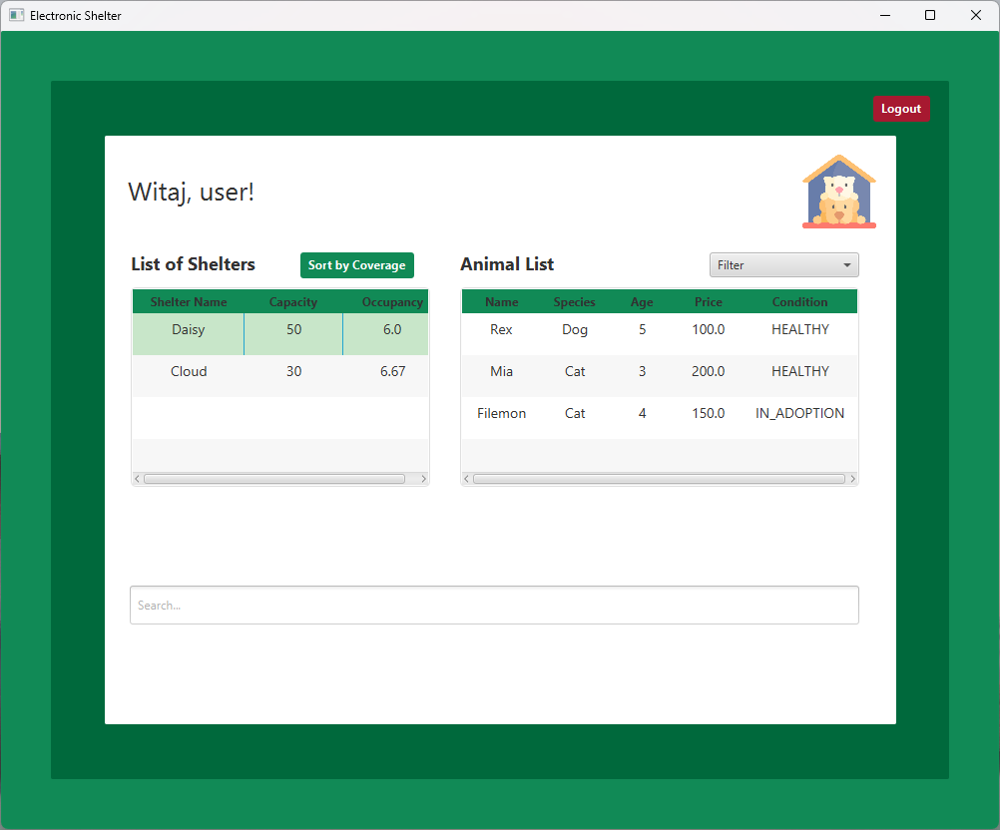

# Shelter Management Application

## Description

The Electronic Shelter Management System is a JavaFX-based application designed to manage animal shelters. It provides functionalities for both administrators and users to manage shelters and animals efficiently. The application includes features such as user authentication, shelter/animal management, and data filtering/sorting.

## Features

- **User Authentication**: Secure login for administrators and users.
- **Shelter Management**: Add, edit, remove, and view shelters.
- **Animal Management**: Add, edit, remove, and view animals within shelters.
- **Adoption Management**: Adopt animals and update their status.
- **Data Filtering**: Filter animals by condition and search by text.
- **Data Sorting**: Sort shelters by occupancy rate.
- **User Interface**: Separate interfaces for administrators and users.

## Technologies Used

- JavaFX for the graphical user interface
- MySQL for the database
- JUnit and Mockito for testing
- Maven for project management and build automation

## Prerequisites

- Java Development Kit (JDK) 17 or higher
- Apache Maven
- MySQL Database

## Installation and Setup

### Step 1: Clone the Repository

```sh
git clone https://github.com/WinterWollf/Electronic-shelter.git
cd Electronic-shelter
```

### Step 2: Set Up the Database

1. Install MySQL.
2. Run the SQL script located in `init.sql` to create the necessary database, tables and insert initial data.

### Step 3: Configure Database Connection

Update the database connection details in the UserService.java file located at UserService.java.

```java
public class UserService {
    private static final String URL = "jdbc:mysql://localhost:3306/shelter";
    private static final String USER = "root";
    private static final String PASSWORD = "";

    ...
}
```

### Step 4: Build and Run the Application

1. Navigate to the project directory.
2. Use Maven to build the project.

```sh
mvn clean install
```

3. Run the application.

```sh
mvn javafx:run
```

## Usage

### Administrator Interface

- **Login**: Use the credentials `admin/admin1234` to log in as an administrator.
- **Manage Shelters**: Add, edit, remove, and view shelters.
- **Manage Animals**: Add, edit, remove, and view animals within shelters.
- **Adopt Animals**: Change the status of animals to adopted.

### User Interface

- **Login**: Use the credentials `user/user1234` to log in as a user.
- **View Shelters**: View the list of shelters.
- **View Animals**: View the list of animals within selected shelters.
- **Adopt Animals**: Adopt animals and update their status.

## Tests

The project includes unit tests to ensure the correctness of the application. The current code coverage is 92%.

### Running Tests

To run the tests, use the following Maven command:

```sh
mvn test
```

## Screenshots

Here are some screenshots showcasing the main features of the application:

### Login Page



### Admin Page



### User Page



## License

This project is licensed under the Creative Commons Attribution-NonCommercial 4.0 International (CC BY-NC 4.0) License - see the [LICENSE](LICENSE.txt) file for details.

## Contact

For any inquiries or feedback, feel free to reach out to the project author:
- **GitHub**: [WinterWollf](https://github.com/WinterWollf)

---
